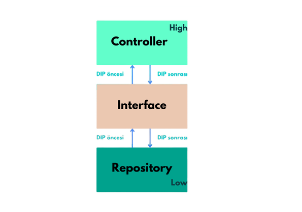

# SOLID Principles
### SOLID, five basic design principles developed to make software design more readable, easier to maintain and expandable are called SOLID.
## Single Responsibilty Principles:

* "There should never be more than are reasons for a class to change"

* A class should not have more than one reason to be changed, i.e. a class should have only one purpose

## Open Closed Principles:

* "Software entities should be open for extensasion but closed for modification."

* Our code should be open for extension but closed for modification.

## Liskov Substitution Principles:

* "An object (such as a class) and a sub-object (such as a class that extends the first class) must be interchangeable without breaking the program

* An object and a child object must be modifiable without breaking the program.

* If you use abstract in a class, the parent class must also be abstract. If a class is abstract, the object cannot be instantiated.

## Interface Segregation Principles:

* "Many client-specific interfaces are batter than one general purpose interface."

* Many client-specific interfaces are better than one general purpose interface. An interface should contain only the methods that are needed and should not contain unnecessary or unused methods.

## Dependency Inversion Principles

* High level modules should not depend on low level modules; both should depend an abstractions.

* High level modules should not depend on low level modules. Both should depend on abstractions. For example, in MVC, a controller is a high level module. There should be a direct connection between the controller and low-level operations such as database access.

* Instead there should be <<interface>> between controller and repository

    

** Before the dip, the flow moves from bottom to top, while with DIP it moves from top to bottom.

"DIP encourages high-level modules not to depend on low-level modules and both to depend on abstractions (interface or abstract classes). This makes your code more flexible and changeable."

Abstraction: "Abstraction means representing objects or structures in a more general and abstract way. Abstractions usually cannot be directly instantiated with the "new" keyword. That is, you do not instantiate an abstract class or interface."

Additional Information: 

Delegate,

It is a C#-specific concept and is used as constructs that point to methods. Here are some embedded delegates used in C#:

Delegates that can be used embedded;

Action: Represents methods that take parameters and return void.

Predicate: Represents methods that take a parameter and return bool.

Function: Represents a method that takes any parameter and returns anything.
